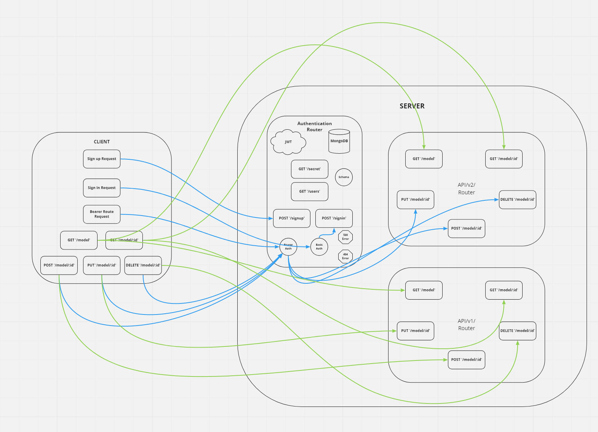

# auth-api
### Heroku applications

[server-deploy-main](https://ibrahimawad-auth-api.herokuapp.com)

### Github actions

[actions](https://github.com/ibrahimAbuawad/auth-api/actions)

### pull request

[Pull request](https://github.com/ibrahimAbuawad/auth-api/pull/1)

### UML  

### CI/CD (continuous integration , continuous deployment)

The "CI" refers to continuous integration, it is an automation process fro developers that means changes to an app is regularly built and merged to a repo, So that can be a good solutions when there are multiple branches of an app .

